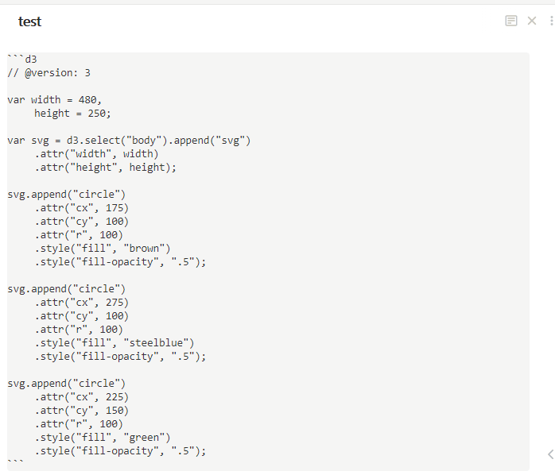

## Obsidian D3

Use D3.js in notes.

**NOTE: This is my learning and experimental project.** 

## Usage

This plugin add `d3` code block to obsidian. It's pure javascript with d3 library.

## Limitation

### fetch is not defined
The fetch function is not implemented in JSDOM, so d3.js function such as `d3.csv` is not work.

### canvas is not implemented
`canvas` HTMLElement is not implemented in JSDOM.  

## Security Concern
This plugin running the code in node.js. DO NOT use it for untrusted code.
See [JSDOM executing-scripts](https://github.com/jsdom/jsdom#executing-scripts) for more detail.

